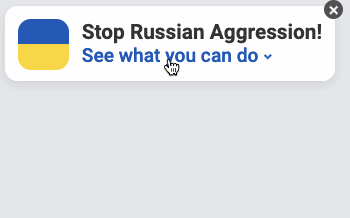
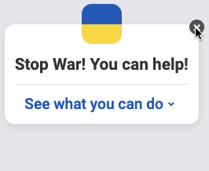
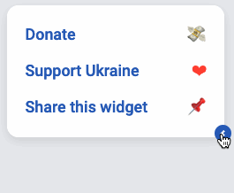
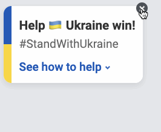

# Help Ukraine Widget for Flutter

[](https://pub.dev/packages/solid_lints)

This is a port of [Help Ukraine Widget](https://helpukrainewinwidget.org/) -
this widget helps to let users of your app know how they can help Ukraine
from anywhere in the world.

## Showcase

<details open><summary>First widget variation</summary>


</details>

<details><summary>Second widget variation</summary>
    

</details>

<details><summary>Third widget variation</summary>


</details>

<details><summary>Fourth widget variation</summary>


</details>

## Features

By installing this widget in your app, you will help to end the war in Ukraine.
It will provide links for:

* [donations](https://uahelp.monobank.ua/),
* sharing this widget
* and [other ways to support Ukraine](https://war.ukraine.ua/).

## Getting started

Add the package as a dependency to your __pubspec.yaml__:

``` yaml
dependencies:
    help_ukraine_widget: <latest version>
```

in your code:

``` dart
import 'package:help_ukraine_widget/help_ukraine_widget.dart';
```

## Usage

### Basic usage

Use `OverlayWidget` to float and align the widget above your app:

``` dart
OverlayWidget(
    alignment: Alignment.bottomRight,
    overlayWidget: HorizontalHelpWidget(),
    child: MyApp(),
)
```

### Customization

You can also create custom variations of this widget:

``` dart
// we used that in our widget, but you do you 
final order = [HelpWidgetView.collapsed, HelpWidgetView.main, HelpWidgetView.options];

final _controller = TraverseController(order);

HelpWidget(
    controller: _controller;
    // view with links to resources that help Ukraine
    optionsView: ...
    // The default first view that the users see.
    mainView: ...
    // smallest view that doesn't obstruct user from
    // using the app, but still exists on the screen
    collapsedView: ...
    // axis of transition animation between views
    axis: ...
)
```

To make it easier we provide some classes:

#### Components

##### Buttons

`DetailsButton` - used in main view to go to options view.

`HelpOptionButton` - used in options view as a link to external resources.

`RoundedButton` - close button for `CardRounded`.

##### Other

`CardRounded` - base widget for every view.

`ChevronDown` - flexible chevron icon.

`FlagCard` - default collapsed view.

`FlagWidget` - flexible widget with Ukraine flag colors.

`HoverWrapper` - add responses for pointer events to your widget.

`XMark` - flexible cross icon.

### Controllers

`TraverseController` is used to track current view and direction of last transition.

### Helpers

`defaultOptionsList` - list of default link buttons for external resources.

`Emojis` - emoji constants just to be a little more descriptive.

`HelpWidgetView` - enum to track current view using `TraverseController`.

### Theme

`FontConfig` - common font settings in project.

`HelpColors` - common colors used in project.

`TextThemes` - common text theming constants.

### Widgets

`HelpWidget` - base class for help widgets.

`LinksCardWidget` - base class for options view.

`UkraineFlagWidget` is the rounded square flag you see in collapsed view.

## Credits

[jiffsy.co](https://jiffsy.co/) for designing and creating the [original widget](https://helpukrainewinwidget.org/).
